```{r setup, include=FALSE}
knitr::opts_chunk$set(echo = FALSE, warning = FALSE, message = FALSE)
```

<style>
body {
  font-family: 'Microsoft YaHei', 'SimHei', sans-serif;
  max-width: 800px;
  margin: 0 auto;
  padding: 20px;
  background-color: #f5f5f5;
}

h1 {
  text-align: center;
  color: #333;
  margin-bottom: 10px;
  font-size: 2.5em;
}

.subtitle {
  text-align: center;
  color: #666;
  margin-bottom: 40px;
  font-size: 1.1em;
}

.painting {
  background: white;
  margin: 40px 0;
  padding: 30px;
  border-radius: 8px;
  box-shadow: 0 2px 8px rgba(0,0,0,0.1);
  transition: box-shadow 0.3s ease;
}

.painting:hover {
  box-shadow: 0 4px 16px rgba(0,0,0,0.15);
}

.painting-number {
  color: #999;
  font-size: 0.9em;
  margin-bottom: 5px;
}

.painting-title {
  font-size: 1.8em;
  color: #2c3e50;
  margin: 10px 0 20px 0;
  font-weight: bold;
}

.painting img {
  width: 100%;
  height: auto;
  border-radius: 4px;
  margin-bottom: 20px;
  cursor: pointer;
  transition: transform 0.3s ease;
}

.painting img:hover {
  transform: scale(1.02);
}

audio {
  width: 100%;
  margin: 15px 0;
  outline: none;
}

.painting-info {
  color: #555;
  line-height: 1.6;
  margin-top: 15px;
  font-size: 0.95em;
}

.painting-description {
  color: #666;
  line-height: 1.8;
  margin-top: 15px;
  padding: 15px;
  background-color: #fafafa;
  border-left: 3px solid #3498db;
  border-radius: 4px;
}

.footer {
  text-align: center;
  margin-top: 60px;
  padding: 20px;
  color: #999;
  font-size: 0.9em;
}

/* 音频播放器美化 */
audio::-webkit-media-controls-panel {
  background-color: #f0f0f0;
}

/* 响应式设计 */
@media (max-width: 600px) {
  body {
    padding: 10px;
  }
  
  .painting {
    padding: 20px;
    margin: 20px 0;
  }
  
  .painting-title {
    font-size: 1.5em;
  }
}
</style>

<div class="subtitle">
欢迎观展 · 请点击播放按钮收听讲解
</div>

---

<!-- 作品 1 -->
<div class="painting">
<div class="painting-number">作品 01</div>
<h2 class="painting-title">Jerusalem from the Mount of Olives</h2>


<audio controls preload="metadata">
  <source src="audio/painting01.m4a" type="audio/mpeg">
  您的浏览器不支持音频播放。
</audio>

<div class="painting-info">
<strong>创作时间：</strong>1870<br>
<strong>尺寸：</strong>60cm × 80cm<br>
<strong>媒介：</strong>布面油画
</div>

<div class="painting-description">
这幅作品描绘了春日山间的宁静景致。远山云雾缭绕，近处溪水潺潺，几株桃花点缀其间。整体色调以淡雅的青绿为主，营造出清新脱俗的意境。
</div>
</div>

---

<!-- 作品 2 -->
<div class="painting">
<div class="painting-number">作品 02</div>
<h2 class="painting-title">都市夜色</h2>

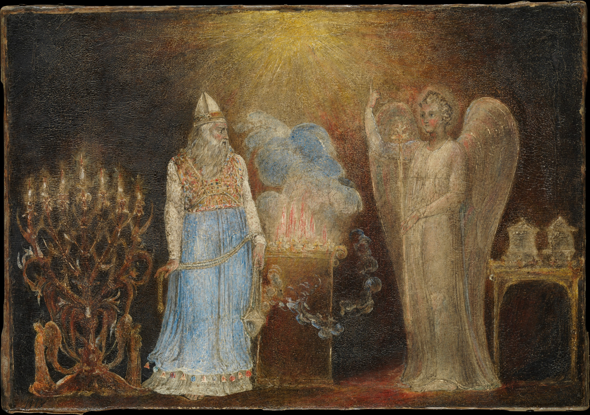

<audio controls preload="metadata">
  <source src="audio/painting02.m4a" type="audio/mpeg">
  您的浏览器不支持音频播放。
</audio>

<div class="painting-info">
<strong>创作时间：</strong>2024年5月<br>
<strong>尺寸：</strong>50cm × 70cm<br>
<strong>媒介：</strong>布面丙烯
</div>

<div class="painting-description">
城市的霓虹在夜幕下闪烁，川流不息的车流化作光的河流。这幅作品捕捉了现代都市的律动与喧嚣，同时也透露出都市人内心的某种孤独。
</div>
</div>

---

<!-- 作品 3 -->
<div class="painting">
<div class="painting-number">作品 03</div>
<h2 class="painting-title">静物·花与书</h2>

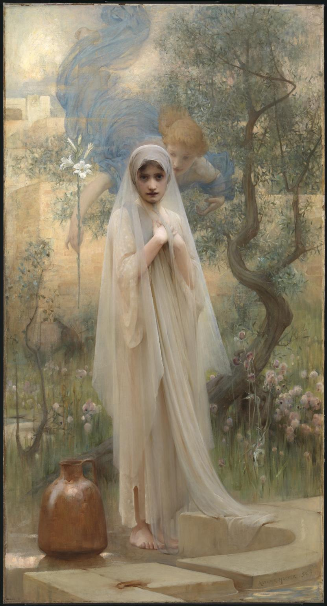

<audio controls preload="metadata">
  <source src="audio/painting03.mp3" type="audio/mpeg">
  您的浏览器不支持音频播放。
</audio>

<div class="painting-info">
<strong>创作时间：</strong>2024年6月<br>
<strong>尺寸：</strong>40cm × 60cm<br>
<strong>媒介：</strong>纸本水彩
</div>

<div class="painting-description">
午后的阳光透过窗户洒在书桌上，一束鲜花插在玻璃瓶中，几本翻开的书静静躺着。这是对日常生活诗意的捕捉，宁静而温暖。
</div>
</div>

---

<!-- 作品 4 -->
<div class="painting">
<div class="painting-number"> 作品 04 </div>
<h2 class="painting-title"> painting04 </h2>

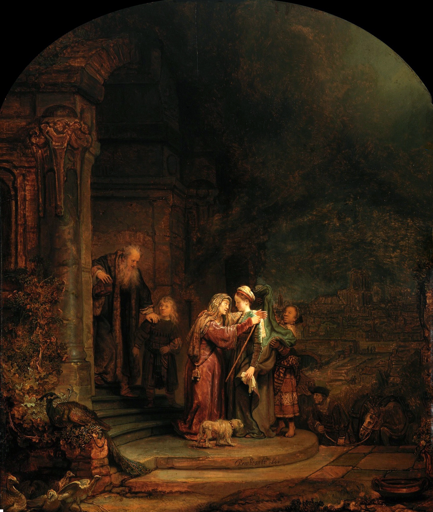

<audio controls preload="metadata">
  <source src="audio/painting04.mp3" type="audio/mpeg">
  您的浏览器不支持音频播放。
</audio>

<div class="painting-info">
<strong>创作时间：</strong> xxxx 年 x 月<br>
<strong>尺寸：</strong>40cm × 60cm<br>
<strong>媒介：</strong>纸本水彩
</div>

<div class="painting-description">
作品描述
</div>
</div>

---

<!-- 作品 5 -->
<div class="painting">
<div class="painting-number"> 作品 05 </div>
<h2 class="painting-title"> painting05 </h2>

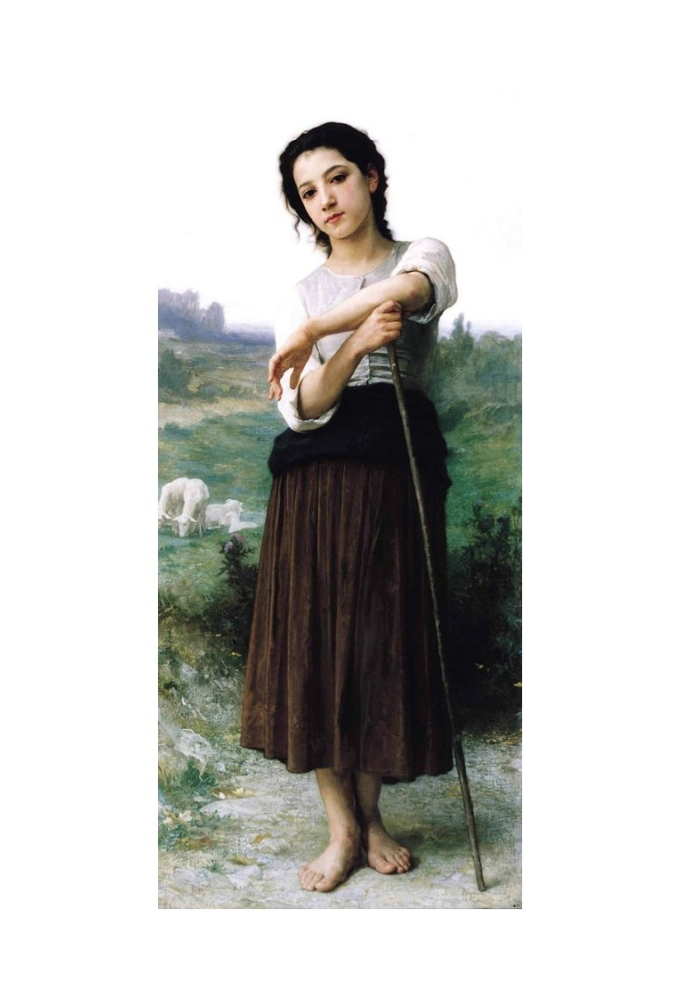

<audio controls preload="metadata">
  <source src="audio/painting05.mp3" type="audio/mpeg">
  您的浏览器不支持音频播放。
</audio>

<div class="painting-info">
<strong>创作时间：</strong> xxxx 年 x 月<br>
<strong>尺寸：</strong>40cm × 60cm<br>
<strong>媒介：</strong>纸本水彩
</div>

<div class="painting-description">
作品描述
</div>
</div>

---

<!-- 作品 6 -->
<div class="painting">
<div class="painting-number"> 作品 06 </div>
<h2 class="painting-title"> painting06 </h2>

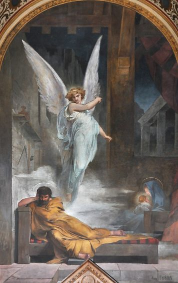

<audio controls preload="metadata">
  <source src="audio/painting06.mp3" type="audio/mpeg">
  您的浏览器不支持音频播放。
</audio>

<div class="painting-info">
<strong>创作时间：</strong> xxxx 年 x 月<br>
<strong>尺寸：</strong>40cm × 60cm<br>
<strong>媒介：</strong>纸本水彩
</div>

<div class="painting-description">
作品描述
</div>
</div>

---

<!-- 作品 7 -->
<div class="painting">
<div class="painting-number"> 作品 07 </div>
<h2 class="painting-title"> painting07 </h2>


<audio controls preload="metadata">
  <source src="audio/painting07.mp3" type="audio/mpeg">
  您的浏览器不支持音频播放。
</audio>

<div class="painting-info">
<strong>创作时间：</strong> xxxx 年 x 月<br>
<strong>尺寸：</strong>40cm × 60cm<br>
<strong>媒介：</strong>纸本水彩
</div>

<div class="painting-description">
作品描述
</div>
</div>

---

<!-- 作品 8 -->
<div class="painting">
<div class="painting-number"> 作品 08 </div>
<h2 class="painting-title"> painting08 </h2>


<audio controls preload="metadata">
  <source src="audio/painting08.mp3" type="audio/mpeg">
  您的浏览器不支持音频播放。
</audio>

<div class="painting-info">
<strong>创作时间：</strong> xxxx 年 x 月<br>
<strong>尺寸：</strong>40cm × 60cm<br>
<strong>媒介：</strong>纸本水彩
</div>

<div class="painting-description">
作品描述
</div>
</div>

---

<!-- 作品 9 -->
<div class="painting">
<div class="painting-number"> 作品 09 </div>
<h2 class="painting-title"> painting09 </h2>


<audio controls preload="metadata">
  <source src="audio/painting09.mp3" type="audio/mpeg">
  您的浏览器不支持音频播放。
</audio>

<div class="painting-info">
<strong>创作时间：</strong> xxxx 年 x 月<br>
<strong>尺寸：</strong>40cm × 60cm<br>
<strong>媒介：</strong>纸本水彩
</div>

<div class="painting-description">
作品描述
</div>
</div>

---

<!-- 作品 10 -->
<div class="painting">
<div class="painting-number"> 作品 10 </div>
<h2 class="painting-title"> painting10 </h2>

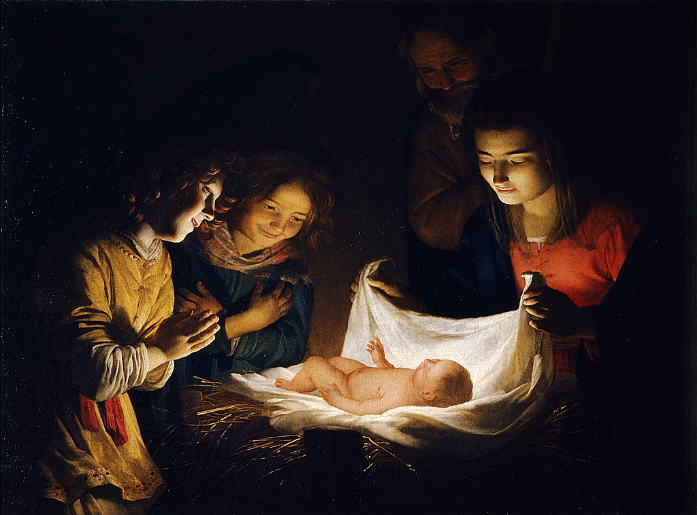

<audio controls preload="metadata">
  <source src="audio/painting10.mp3" type="audio/mpeg">
  您的浏览器不支持音频播放。
</audio>

<div class="painting-info">
<strong>创作时间：</strong> xxxx 年 x 月<br>
<strong>尺寸：</strong>40cm × 60cm<br>
<strong>媒介：</strong>纸本水彩
</div>

<div class="painting-description">
作品描述
</div>
</div>

---

<!-- 作品 11 -->
<div class="painting">
<div class="painting-number"> 作品 11 </div>
<h2 class="painting-title"> painting11 </h2>

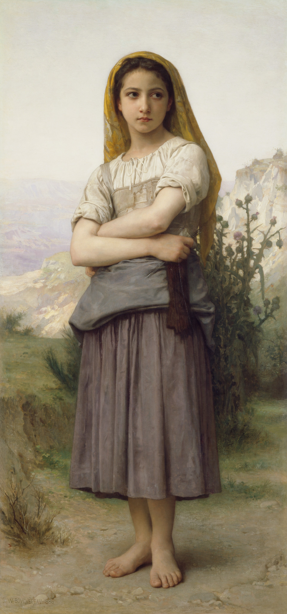

<audio controls preload="metadata">
  <source src="audio/painting11.mp3" type="audio/mpeg">
  您的浏览器不支持音频播放。
</audio>

<div class="painting-info">
<strong>创作时间：</strong> xxxx 年 x 月<br>
<strong>尺寸：</strong>40cm × 60cm<br>
<strong>媒介：</strong>纸本水彩
</div>

<div class="painting-description">
作品描述
</div>
</div>

---

<!-- 作品 12 -->
<div class="painting">
<div class="painting-number"> 作品 12 </div>
<h2 class="painting-title"> painting12 </h2>


<audio controls preload="metadata">
  <source src="audio/painting12.mp3" type="audio/mpeg">
  您的浏览器不支持音频播放。
</audio>

<div class="painting-info">
<strong>创作时间：</strong> xxxx 年 x 月<br>
<strong>尺寸：</strong>40cm × 60cm<br>
<strong>媒介：</strong>纸本水彩
</div>

<div class="painting-description">
作品描述
</div>
</div>

---

<!-- 作品 13 -->
<div class="painting">
<div class="painting-number"> 作品 13 </div>
<h2 class="painting-title"> painting13 </h2>

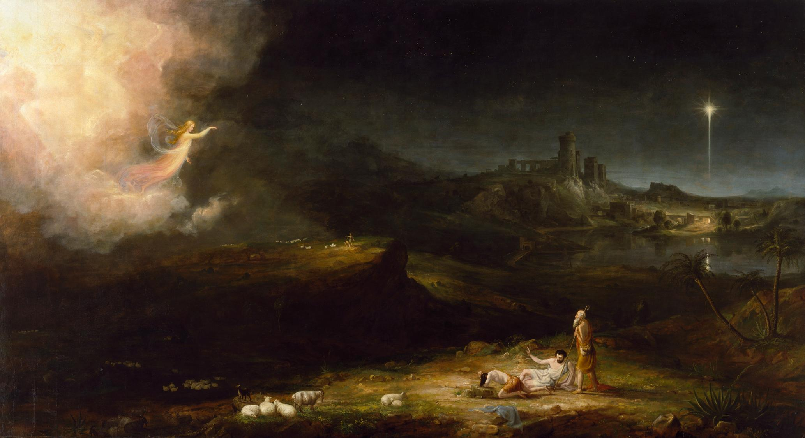

<audio controls preload="metadata">
  <source src="audio/painting13.mp3" type="audio/mpeg">
  您的浏览器不支持音频播放。
</audio>

<div class="painting-info">
<strong>创作时间：</strong> xxxx 年 x 月<br>
<strong>尺寸：</strong>40cm × 60cm<br>
<strong>媒介：</strong>纸本水彩
</div>

<div class="painting-description">
作品描述
</div>
</div>

---

<!-- 作品 14 -->
<div class="painting">
<div class="painting-number"> 作品 14 </div>
<h2 class="painting-title"> painting14 </h2>


<audio controls preload="metadata">
  <source src="audio/painting14.mp3" type="audio/mpeg">
  您的浏览器不支持音频播放。
</audio>

<div class="painting-info">
<strong>创作时间：</strong> xxxx 年 x 月<br>
<strong>尺寸：</strong>40cm × 60cm<br>
<strong>媒介：</strong>纸本水彩
</div>

<div class="painting-description">
作品描述
</div>
</div>

---

<!-- 作品 15 -->
<div class="painting">
<div class="painting-number"> 作品 15 </div>
<h2 class="painting-title"> painting15 </h2>

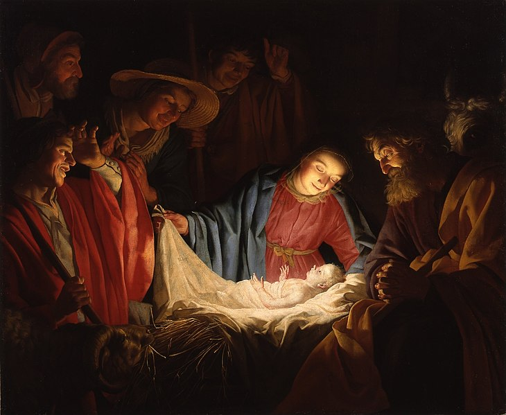

<audio controls preload="metadata">
  <source src="audio/painting15.mp3" type="audio/mpeg">
  您的浏览器不支持音频播放。
</audio>

<div class="painting-info">
<strong>创作时间：</strong> xxxx 年 x 月<br>
<strong>尺寸：</strong>40cm × 60cm<br>
<strong>媒介：</strong>纸本水彩
</div>

<div class="painting-description">
作品描述
</div>
</div>

---

<!-- 作品 16 -->
<div class="painting">
<div class="painting-number"> 作品 16 </div>
<h2 class="painting-title"> painting16 </h2>


<audio controls preload="metadata">
  <source src="audio/painting16.mp3" type="audio/mpeg">
  您的浏览器不支持音频播放。
</audio>

<div class="painting-info">
<strong>创作时间：</strong> xxxx 年 x 月<br>
<strong>尺寸：</strong>40cm × 60cm<br>
<strong>媒介：</strong>纸本水彩
</div>

<div class="painting-description">
作品描述
</div>
</div>

---

<!-- 作品 17 -->
<div class="painting">
<div class="painting-number"> 作品 17 </div>
<h2 class="painting-title"> painting17 </h2>

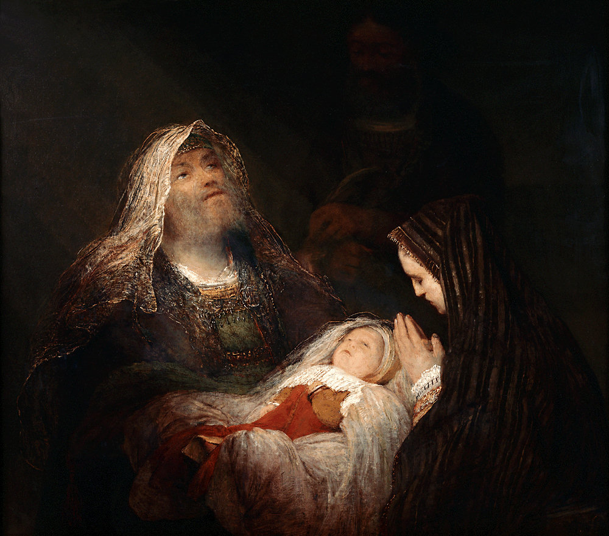

<audio controls preload="metadata">
  <source src="audio/painting17.mp3" type="audio/mpeg">
  您的浏览器不支持音频播放。
</audio>

<div class="painting-info">
<strong>创作时间：</strong> xxxx 年 x 月<br>
<strong>尺寸：</strong>40cm × 60cm<br>
<strong>媒介：</strong>纸本水彩
</div>

<div class="painting-description">
作品描述
</div>
</div>

---

<!-- 作品 18 -->
<div class="painting">
<div class="painting-number"> 作品 18 </div>
<h2 class="painting-title"> painting18 </h2>


<audio controls preload="metadata">
  <source src="audio/painting18.mp3" type="audio/mpeg">
  您的浏览器不支持音频播放。
</audio>

<div class="painting-info">
<strong>创作时间：</strong> xxxx 年 x 月<br>
<strong>尺寸：</strong>40cm × 60cm<br>
<strong>媒介：</strong>纸本水彩
</div>

<div class="painting-description">
作品描述
</div>
</div>

---

<!-- 作品 19 -->
<div class="painting">
<div class="painting-number"> 作品 19 </div>
<h2 class="painting-title"> painting19 </h2>


<audio controls preload="metadata">
  <source src="audio/painting19.mp3" type="audio/mpeg">
  您的浏览器不支持音频播放。
</audio>

<div class="painting-info">
<strong>创作时间：</strong> xxxx 年 x 月<br>
<strong>尺寸：</strong>40cm × 60cm<br>
<strong>媒介：</strong>纸本水彩
</div>

<div class="painting-description">
作品描述
</div>
</div>

---

<!-- 作品 20 -->
<div class="painting">
<div class="painting-number"> 作品 20 </div>
<h2 class="painting-title"> painting20 </h2>

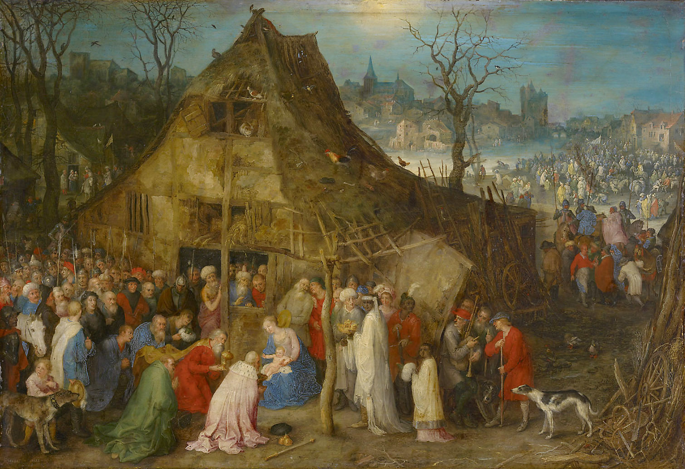

<audio controls preload="metadata">
  <source src="audio/painting20.mp3" type="audio/mpeg">
  您的浏览器不支持音频播放。
</audio>

<div class="painting-info">
<strong>创作时间：</strong> xxxx 年 x 月<br>
<strong>尺寸：</strong>40cm × 60cm<br>
<strong>媒介：</strong>纸本水彩
</div>

<div class="painting-description">
作品描述
</div>
</div>

---

<!-- 作品 21 -->
<div class="painting">
<div class="painting-number"> 作品 21 </div>
<h2 class="painting-title"> painting21 </h2>

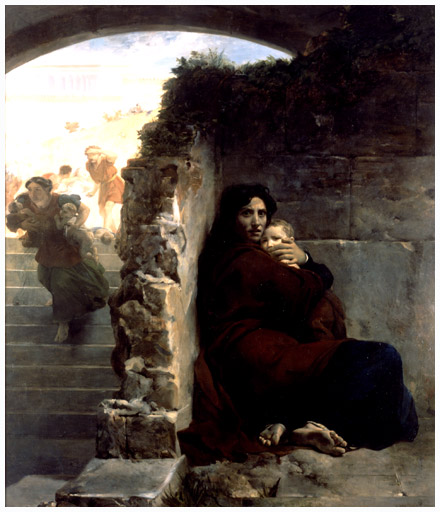

<audio controls preload="metadata">
  <source src="audio/painting21.mp3" type="audio/mpeg">
  您的浏览器不支持音频播放。
</audio>

<div class="painting-info">
<strong>创作时间：</strong> xxxx 年 x 月<br>
<strong>尺寸：</strong>40cm × 60cm<br>
<strong>媒介：</strong>纸本水彩
</div>

<div class="painting-description">
作品描述
</div>
</div>

---

<!-- 作品 22 -->
<div class="painting">
<div class="painting-number"> 作品 22 </div>
<h2 class="painting-title"> painting22 </h2>

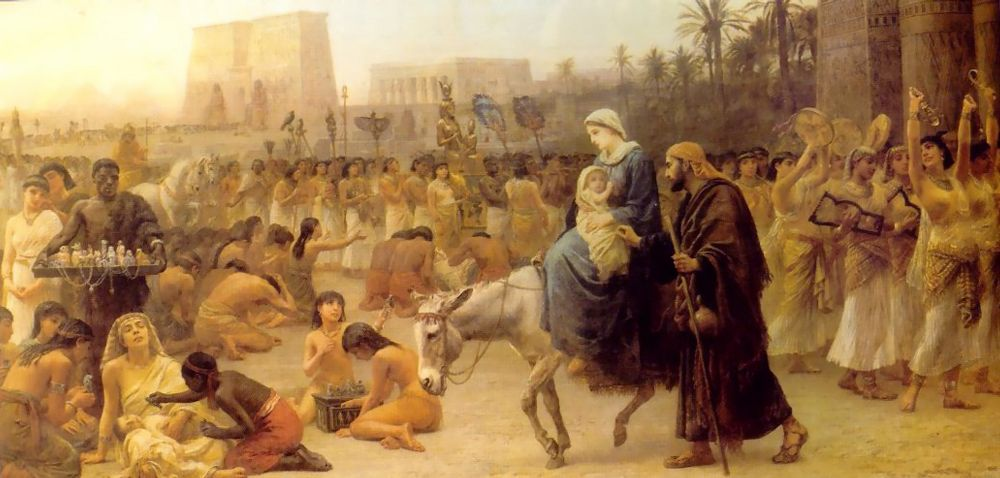

<audio controls preload="metadata">
  <source src="audio/painting22.mp3" type="audio/mpeg">
  您的浏览器不支持音频播放。
</audio>

<div class="painting-info">
<strong>创作时间：</strong> xxxx 年 x 月<br>
<strong>尺寸：</strong>40cm × 60cm<br>
<strong>媒介：</strong>纸本水彩
</div>

<div class="painting-description">
作品描述
</div>
</div>

---

<!-- 作品 23 -->
<div class="painting">
<div class="painting-number"> 作品 23 </div>
<h2 class="painting-title"> painting23 </h2>

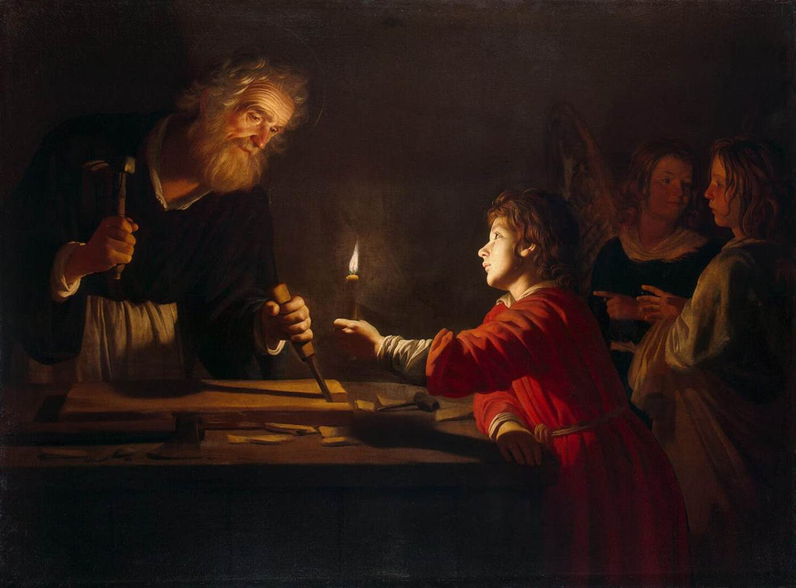

<audio controls preload="metadata">
  <source src="audio/painting23.mp3" type="audio/mpeg">
  您的浏览器不支持音频播放。
</audio>

<div class="painting-info">
<strong>创作时间：</strong> xxxx 年 x 月<br>
<strong>尺寸：</strong>40cm × 60cm<br>
<strong>媒介：</strong>纸本水彩
</div>

<div class="painting-description">
作品描述
</div>
</div>

---

<!-- 作品 24 -->
<div class="painting">
<div class="painting-number"> 作品 24 </div>
<h2 class="painting-title"> painting24 </h2>


<audio controls preload="metadata">
  <source src="audio/painting24.mp3" type="audio/mpeg">
  您的浏览器不支持音频播放。
</audio>

<div class="painting-info">
<strong>创作时间：</strong> xxxx 年 x 月<br>
<strong>尺寸：</strong>40cm × 60cm<br>
<strong>媒介：</strong>纸本水彩
</div>

<div class="painting-description">
作品描述
</div>
</div>

---

<!-- 作品 25 -->
<div class="painting">
<div class="painting-number"> 作品 25 </div>
<h2 class="painting-title"> painting25 </h2>


<audio controls preload="metadata">
  <source src="audio/painting25.mp3" type="audio/mpeg">
  您的浏览器不支持音频播放。
</audio>

<div class="painting-info">
<strong>创作时间：</strong> xxxx 年 x 月<br>
<strong>尺寸：</strong>40cm × 60cm<br>
<strong>媒介：</strong>纸本水彩
</div>

<div class="painting-description">
作品描述
</div>
</div>

---

<!-- 继续添加更多作品，重复上面的结构... -->

<!-- 作品 4-30 的模板，你可以复制粘贴修改 -->

<!--
<div class="painting">
<div class="painting-number">作品 XX</div>
<h2 class="painting-title">画作标题</h2>


<audio controls preload="metadata">
  <source src="audio/paintingXX.mp3" type="audio/mpeg">
  您的浏览器不支持音频播放。
</audio>

<div class="painting-info">
<strong>创作时间：</strong>YYYY年MM月<br>
<strong>尺寸：</strong>XXcm × XXcm<br>
<strong>媒介：</strong>材料类型
</div>

<div class="painting-description">
作品简介和创作背景...
</div>
</div>

---
-->

<div class="footer">
© 2024 Farea 个人画展 · 感谢您的观展
</div>

```{r, include=FALSE}
# 可选：如果你想用R生成画作列表，可以用这个代码块
# 
# paintings <- data.frame(
#   number = sprintf("%02d", 1:30),
#   title = c("春山行旅", "都市夜色", "静物·花与书", ...), # 30个标题
#   date = c("2024年3月", ...),
#   size = c("60cm × 80cm", ...),
#   medium = c("布面油画", ...),
#   description = c("作品描述...", ...)
# )
# 
# # 然后用循环生成HTML
```
